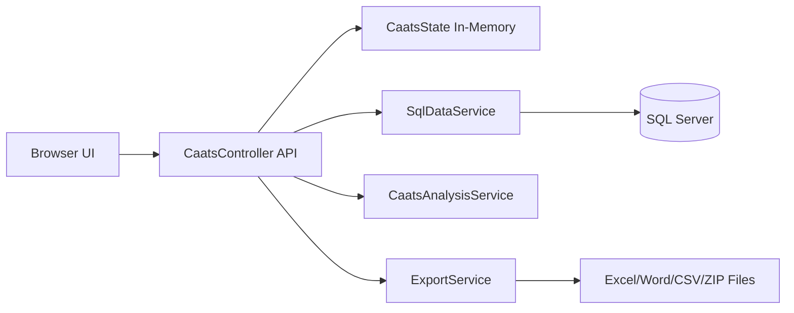

# CAATS Web App Architecture

## 1. Purpose
The CAATS Web App is an ASP.NET Core MVC application used to run Journal Entry (JE) audit analytics from client GL and TB data, then export professional working papers (Word/Excel/CSV/ZIP).

## 2. Technology Stack
- Platform: .NET 10, ASP.NET Core MVC
- UI: Razor views + JavaScript + CSS
- Data Access: `Microsoft.Data.SqlClient`
- Document Export:
  - Excel: ClosedXML
  - Word: Open XML SDK
- Runtime state: in-memory singleton state container (`CaatsState`)

## 3. High-Level Components
- `Program.cs`
  - Registers MVC and response compression.
  - Registers singleton services:
    - `CaatsState`
    - `SqlDataService`
    - `CaatsAnalysisService`
    - `ExportService`
- `Controllers/CaatsController.cs`
  - API orchestration for connect/load/map/profile/run/explore/export/download.
- `Services/Caats/SqlDataService.cs`
  - SQL Server metadata and table data retrieval.
- `Services/Caats/CaatsAnalysisService.cs`
  - JE analytics engine (flags, recon, Benford, risk-oriented structures).
- `Services/Caats/ExportService.cs`
  - Output generation for Excel/Word/CSV/ZIP working papers.
- `Models/Caats/*`
  - Request/response DTOs and analysis result models.
- `Views/Home/Index.cshtml`
  - Step-by-step dashboard UI.
- `wwwroot/js/site.js`
  - Client workflow logic and API calls.
- `wwwroot/css/site.css`
  - Theming and layout styles.

## 4. Request Flow
1. Browser loads dashboard (`Home/Index`).
2. UI calls API:
   - Connect server and select database.
   - Select GL/TB tables and save column mappings.
   - Load full data and run profiling.
   - Save engagement setup and run analytics.
3. Controller stores run outputs in `CaatsState`.
4. User explores filtered data and exports working papers.

## 5. Core API Endpoints
Base route: `/api/caats`

- `GET /drivers`
- `GET /default-output-folder`
- `POST /connect`
- `POST /database`
- `GET /tables`
- `POST /preview`
- `POST /mapping`
- `POST /load-data`
- `POST /profile`
- `POST /engagement`
- `POST /run`
- `POST /export`
- `GET /download`
- `POST /explore`

## 6. Analysis Pipeline (Simplified)
Inside `CaatsAnalysisService.Run(...)`:
1. Normalize GL rows into `MasterRow`.
2. Apply engagement period filter.
3. Derive day/holiday markers and test flags.
4. Compute duplicate/unbalanced/low-FSLI flags.
5. Build GL-TB reconciliation output.
6. Run Benford first-digit analysis.
7. Return datasets for UI + exports.

## 7. Export Architecture
`ExportService` creates the final package from `CaatsState`:
- Excel workbook sheets for all procedures and detailed result tables.
- Word working paper with structured sections, ToC, aligned tables, and auditor comment blocks.
- Optional CSV and ZIP packaging.

## 8. State Model
`CaatsState` holds:
- Connection and table context
- Loaded GL/TB `DataTable`
- Mapping dictionaries
- Engagement settings
- Latest analysis outputs (master/recon/benford/risk/user/procedure/IRI)

Note: This design is session-like in-memory state and is best suited for single-instance usage.

## 9. Security and Operational Notes
- SQL connection supports trusted or SQL-auth login.
- Download endpoint restricts extension types (`.xlsx`, `.docx`, `.csv`, `.zip`).
- Output folder defaults to current user desktop `JE_Audit`.
- For production hardening, add authentication/authorization and persistent storage.

## 10. Deployment Shape
Current pattern is local desktop/web execution:
- Start from project folder:
  - `dotnet run --project c:\Users\Mamishi.Madire\Desktop\Webapp\CaatsWebApp\CaatsWebApp.csproj --urls "http://127.0.0.1:5099"`
- Open in browser: `http://127.0.0.1:5099`

## 11. Logical Diagram

